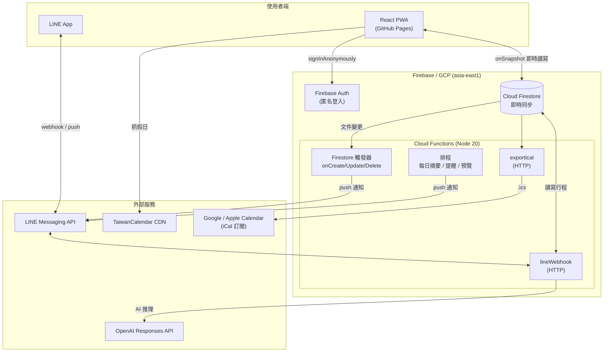

# BiBi Schedule 🗓️

> 專為情侶／雙人設計的共享行事曆 PWA，整合 LINE 機器人、AI 自然語言記事與行事曆訂閱匯出。

一套以 **React + Firebase** 打造的雙人共享行程系統。網頁端可安裝為 PWA 離線使用，並透過 LINE 機器人用自然語言（含 AI agent）新增／查詢／修改行程，還能主動推播每日摘要與提醒，並以 iCal 格式同步到 Google / Apple Calendar。

---

## 目錄

- [功能特色](#功能特色)
- [系統架構](#系統架構)
- [技術棧](#技術棧)
- [專案結構](#專案結構)
- [資料結構（Firestore）](#資料結構firestore)
- [本地開發](#本地開發)
- [部署](#部署)
- [環境變數與密鑰](#環境變數與密鑰)
- [外部整合](#外部整合)
- [未來優化方向](#未來優化方向)

---

## 功能特色

### 📱 網頁前端（PWA）
- **月曆檢視**：以「週一為起始」的月曆，支援左右滑動切換月份、觸覺回饋（haptic）。
- **多日／跨週事件**：自動分配軌道（lane packing）避免重疊，跨週事件以週為單位分段顯示。
- **雙人角色標記**：每筆行程可標記為「我 / 另一半 / 共同」（`me` / `partner` / `common`），角色名稱可自訂。
- **共享機制**：以匿名登入產生的 UID 配對，貼上對方 UID 即可共看同一份行事曆。
- **即將到來**：彙整未來行程，多日事件以週分段、不重複洗版。
- **台灣國定假日**：自 [TaiwanCalendar](https://github.com/ruyut/TaiwanCalendar) CDN 取得，並內建 fallback。
- **節日動畫特效**：春節、端午、中秋、聖誕、情人節等彩蛋。
- **5 種佈景主題**：日和拿鐵 / 粉紅戀愛 / 極簡純白 / 航海王 等，含莫蘭迪色票。
- **離線可用**：Service Worker 快取 App Shell 與靜態資源，HTML 採 network-first、靜態資源 cache-first，並自動偵測新版本更新。
- **可安裝**：支援 Android `beforeinstallprompt` 與 iOS Safari「加入主畫面」引導。

### 🤖 LINE 機器人後端
- **自然語言記事**：「明天下午三點開會」「下週三晚上七點吃飯」等口語直接建立行程。
- **AI Agent**：接 OpenAI Responses API（function calling + 內建網路搜尋），可多步推理新增／查詢／修改／刪除行程。
- **查詢指令**：今日 / 明天 / 本週 / 下週 / 整月 / 週末 / 空檔查詢等。
- **主動通知**：新增事件即時通知、每日早晨摘要、開始前提醒、週日預覽（可個別開關）。
- **稍後提醒**：每 5 分鐘掃描 `pending_reminders` 推播到期提醒。
- **帳號綁定**：將 LINE 使用者綁定到 Firestore UID。
- **iCal 匯出**：產生帶 token 的訂閱 URL，貼到 Google / Apple Calendar「從 URL 訂閱」即可同步。

---

## 系統架構



**重點**

- **前端**部署在 **GitHub Pages**（base path `/schedule/`），為純靜態 SPA，直接以 Firebase Web SDK 連線 Firestore。
- **後端**為 **Firebase Cloud Functions**，承載 LINE webhook、Firestore 觸發器、排程任務與 iCal HTTP endpoint。
- 前後端透過 **同一個 Firestore** 交換資料，達成「網頁編輯 ↔ LINE 操作」雙向同步。

---

## 技術棧

| 層級 | 技術 | 說明 |
|---|---|---|
| 前端框架 | **React 18** | 單頁應用（`src/App.jsx`） |
| 建置工具 | **Vite 6** | `base: /schedule/`、手動分包 vendor、自動注入 SW 版本 |
| 樣式 | **Tailwind CSS 3** + PostCSS / Autoprefixer | 搭配 inline style 套用主題色 |
| 圖示 | **lucide-react** | |
| 字型 | NaikaiFont（本地 woff2） | 自訂內海字體 |
| 認證 | **Firebase Auth** | 匿名登入（`signInAnonymously`） |
| 資料庫 | **Cloud Firestore** | 即時 `onSnapshot` 同步 |
| 後端 | **Firebase Cloud Functions v2**（Node 20，asia-east1） | HTTP / Firestore 觸發器 / 排程 |
| 機器人 | **@line/bot-sdk** | LINE Messaging API |
| AI | **OpenAI Responses API**（`gpt-4o-mini`） | function calling + web search |
| PWA | 自製 Service Worker（`public/sw.js`） | 離線快取 + 自動更新 |
| CI/CD | **GitHub Actions** | 前端 → GitHub Pages；Functions → Firebase |
| 外部資料 | TaiwanCalendar CDN | 台灣國定假日 |

---

## 專案結構

```
schedule/
├── index.html                 # HTML 入口（PWA manifest、SW 註冊、字型 preload）
├── vite.config.js             # Vite 設定（base、分包、SW 版本注入）
├── tailwind.config.js         # Tailwind 設定
├── postcss.config.js
├── firebase.json              # Firebase Functions 設定
├── .firebaserc                # Firebase 專案別名（schdule-f5cda）
├── package.json               # 前端依賴與 scripts
│
├── src/
│   ├── main.jsx               # React 進入點（含 ErrorBoundary）
│   ├── App.jsx                # 主應用（月曆、Modal、主題、共享、假日…）
│   └── index.css              # 全域樣式與動畫
│
├── public/
│   ├── sw.js                  # Service Worker
│   ├── icon.png               # App 圖示
│   └── NaikaiFont-SemiBold.woff2
│
├── functions/                 # Firebase Cloud Functions
│   ├── index.js               # 後端全部邏輯（LINE / AI / 通知 / iCal）
│   └── package.json           # 後端依賴（Node 20）
│
├── .github/workflows/
│   ├── deploy.yml             # 前端 → GitHub Pages
│   └── deploy-functions.yml   # Functions → Firebase
│
└── LINE_NOTIFICATIONS_TODO.md # LINE 整合的完整實作說明與費用估算
```

---

## 資料結構（Firestore）

所有資料以 `appId = schdule-f5cda` 為根命名空間。

### 行程事件
```
artifacts/{appId}/users/{uid}/bibi_events/{eventId}
{
  title:      string,            // 標題
  description:string,            // 備註
  startDate:  "YYYY-MM-DD",      // 開始日
  endDate:    "YYYY-MM-DD",      // 結束日
  isAllDay:   boolean,           // 是否全天
  startTime:  "HH:MM",           // 開始時間（非全天）
  endTime:    "HH:MM",           // 結束時間（非全天）
  color:      string,            // 色票 key（如 latte / smokedPlum）
  eventType:  "me"|"partner"|"common"   // 歸屬：我 / 另一半 / 共同
}
```

### 使用者設定
```
artifacts/{appId}/users/{uid}/bibi_settings/roles    # { role1, role2 } 角色名稱
artifacts/{appId}/users/{uid}/bibi_settings/export   # { icalToken } iCal 匯出 token
artifacts/{appId}/users/{uid}/bibi_settings/line     # { lineUserIds: [...] } LINE 綁定
artifacts/{appId}/users/{uid}/bibi_settings/usage    # LINE / AI 用量
artifacts/{appId}/users/{uid}/bibi_settings/lastop   # 最近一次操作（供復原）
```

### 系統 / 後端用
```
artifacts/{appId}/pending_reminders/{id}   # 稍後提醒佇列（cron 掃描）
ai_conversations / ai_logs / ai_usage / ai_rate_limit   # AI agent 對話與用量
sticky_notes                                # 便利貼
webhook_dedup                               # LINE webhook 去重
```

---

## 本地開發

### 前置需求
- Node.js 20
- 一個 Firebase 專案（Firestore + Auth 啟用匿名登入）

### 前端
```bash
npm install        # 安裝依賴
npm run dev        # 本地開發伺服器（Vite）
npm run build      # 產生 dist/（含 SW 版本注入）
npm run preview    # 預覽 build 結果
```

> Firebase Web 設定（`firebaseConfig`）目前寫在 `src/App.jsx` 頂部。
> 這組金鑰是 Firebase Web App 的公開識別資訊（非機密），實際存取權限由 Firestore 安全規則控管。

### 後端（Functions）
```bash
cd functions
npm install
npm run serve      # Firebase 模擬器（僅 functions）
npm run deploy     # 部署到 Firebase
npm run logs       # 查看雲端 log
```

---

## 部署

| 目標 | 觸發 | 流程 |
|---|---|---|
| **前端** | push 到 `main` | `.github/workflows/deploy.yml`：`npm ci` → `npm run build` → 上傳 `dist/` → 部署 GitHub Pages |
| **Functions** | push 到 `main` | `.github/workflows/deploy-functions.yml`：安裝依賴 → Google 服務帳號驗證 → `firebase deploy --only functions` |

> Functions 需 Firebase **Blaze（隨用隨付）** 方案，因為要對外呼叫 LINE / OpenAI API（Spark 免費方案禁止 outbound HTTPS）。一般雙人用量落在免費額度內。

---

## 環境變數與密鑰

後端密鑰以 **Firebase Secret Manager**（`defineSecret`）管理：

| 密鑰 | 用途 |
|---|---|
| `LINE_CHANNEL_ACCESS_TOKEN` | LINE Messaging API 推播 / 回覆 |
| `LINE_CHANNEL_SECRET` | 驗證 LINE webhook 簽章 |
| `OPENAI_API_KEY` | AI agent（OpenAI Responses API） |

GitHub Actions 另需 Repository Secret：

| Secret | 用途 |
|---|---|
| `FIREBASE_SERVICE_ACCOUNT` | CI 部署 Functions 用的 GCP 服務帳號 JSON |

設定步驟與費用估算詳見 [`LINE_NOTIFICATIONS_TODO.md`](./LINE_NOTIFICATIONS_TODO.md)。

---

## 外部整合

| 服務 | 用途 | 方向 |
|---|---|---|
| **LINE Messaging API** | 機器人記事、通知推播 | 雙向 |
| **OpenAI Responses API** | AI 自然語言行程操作 | 後端呼叫 |
| **TaiwanCalendar CDN** | 台灣國定假日 | 前後端讀取 |
| **Google / Apple Calendar** | iCal（`.ics`）URL 訂閱 | 單向匯出（唯讀） |

> 目前與 Google 行事曆的整合為 **iCal 訂閱（單向、唯讀、非即時）**。
> 若需 **雙向即時同步**，可改接 Google Calendar API（需加 OAuth 授權流程）。

---

## 未來優化方向

> 以下為可評估的改進項目，尚未實作。

- **安全**：將 Firestore 安全規則（`firestore.rules`）納入版本控管；iCal token 支援輪替。
- **效能**：對 NaikaiFont 做中文字型子集化（subset），大幅縮小字型體積。
- **可維護性**：將龐大的 `App.jsx` 與 `functions/index.js` 拆分為模組；補上 ESLint / 測試。
- **CI**：加入 build / lint 檢查與路徑過濾（functions 變更才部署 functions）。
- **行事曆整合**：評估 Google Calendar API 雙向即時同步。

---

<sub>本專案為個人／雙人自用之行事曆系統。</sub>
